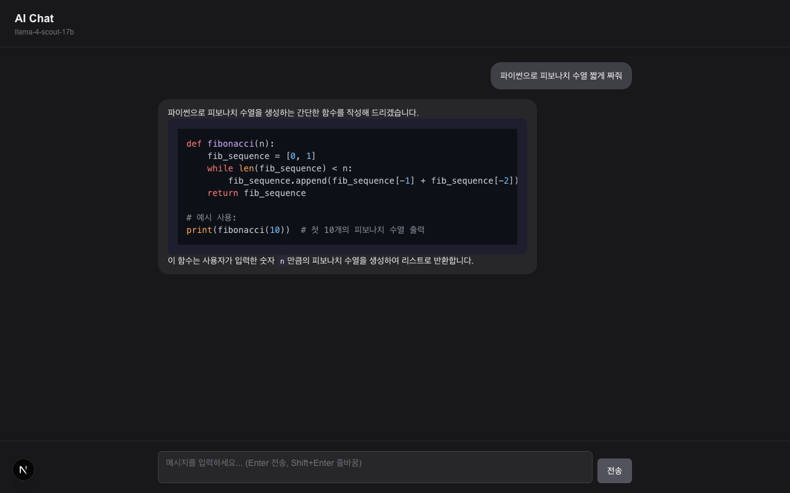

# AI Chat


Groq API 기반 로컬 AI 채팅 앱. 스트리밍 응답과 마크다운 렌더링을 지원합니다.



## 시작하기

### 1. 저장소 클론

```bash
git clone https://github.com/cmos00/ai-chatbot.git
cd ai-chatbot/ai-chat
```

### 2. 의존성 설치

```bash
npm install
```

### 3. API 키 설정

[console.groq.com](https://console.groq.com) 에서 무료로 API 키를 발급받은 후:

```bash
cp .env.example .env.local
```

`.env.local` 파일을 열어 발급받은 키를 입력합니다:

```
GROQ_API_KEY=gsk_your_key_here
```

### 4. 개발 서버 실행

```bash
npm run dev
```

브라우저에서 [http://localhost:3000](http://localhost:3000) 접속

## 기술 스택

- **Framework**: Next.js 16+ (App Router)
- **Language**: TypeScript
- **Styling**: Tailwind CSS + shadcn/ui
- **AI**: Groq API — `meta-llama/llama-4-scout-17b-16e-instruct`
- **Markdown**: react-markdown + remark-gfm + rehype-highlight
